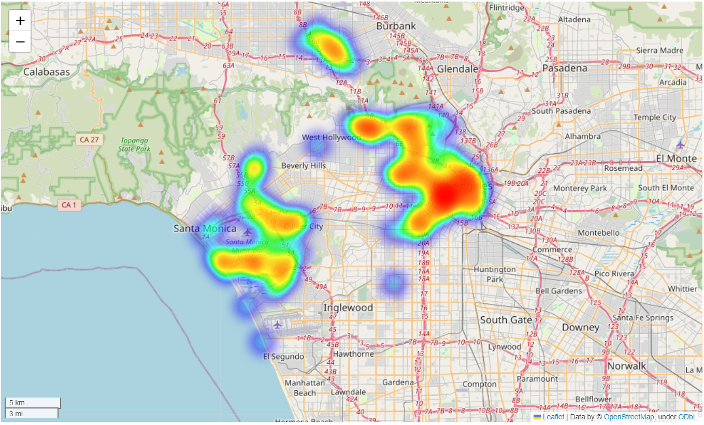

# BikeshareAnalysis
Analyze the spatial-temporal distribution of bikeshare trips.

Link to download data: [https://bikeshare.metro.net/about/data/].

  

<!DOCTYPE html>
<html>
<head>
    
    <meta http-equiv="content-type" content="text/html; charset=UTF-8" />
    
        
    
    
    
    
    
    
    
    <link rel="stylesheet" href="https://cdn.jsdelivr.net/npm/leaflet@1.9.3/dist/leaflet.css"/>
    <link rel="stylesheet" href="https://cdn.jsdelivr.net/npm/bootstrap@5.2.2/dist/css/bootstrap.min.css"/>
    <link rel="stylesheet" href="https://netdna.bootstrapcdn.com/bootstrap/3.0.0/css/bootstrap.min.css"/>
    <link rel="stylesheet" href="https://cdn.jsdelivr.net/npm/@fortawesome/fontawesome-free@6.2.0/css/all.min.css"/>
    <link rel="stylesheet" href="https://cdnjs.cloudflare.com/ajax/libs/Leaflet.awesome-markers/2.0.2/leaflet.awesome-markers.css"/>
    <link rel="stylesheet" href="https://cdn.jsdelivr.net/gh/python-visualization/folium/folium/templates/leaflet.awesome.rotate.min.css"/>
    
            <meta name="viewport" content="width=device-width,
                initial-scale=1.0, maximum-scale=1.0, user-scalable=no" />
            
        
    
</head>
<body>
    
    
            

        
</body>

</html>
